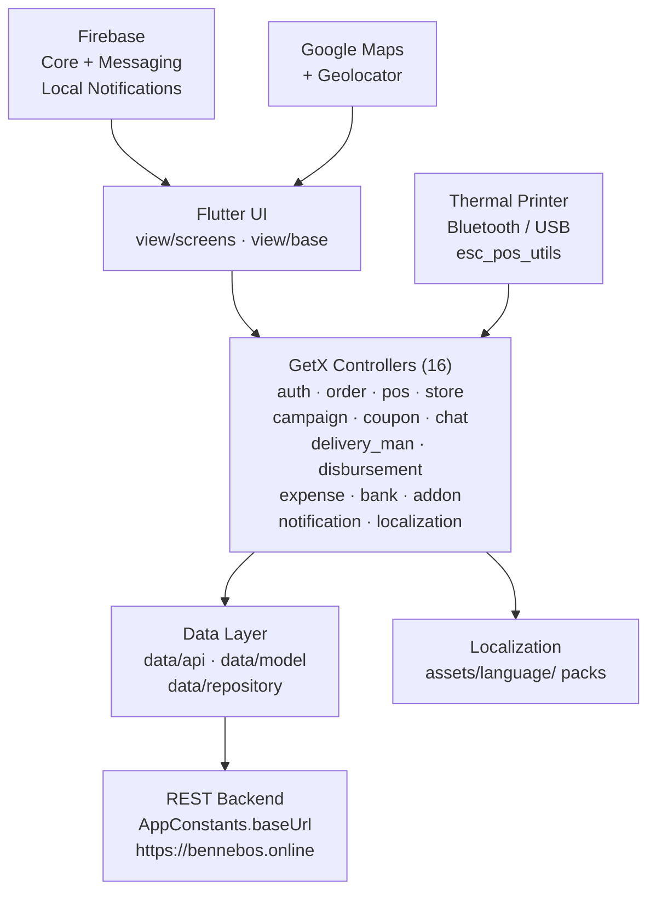

<p align="center">
  
</p>

<p align="center">
  
  
  
  
  
  
</p>

> **Developed by [Arslan Malik](https://github.com/arsalanmaalik461)**
> 📱 WhatsApp: [+92 300 8987448](https://wa.me/923008987448) · 🌐 Website: [arslanmalik.tech](https://arslanmalik.tech)

# 🏪 Bennebos Store App

> *Vendor app for a multi-vendor eCommerce & restaurant platform.*

---

## 🌟 Executive Overview

**Bennebos Store** is a cross-platform (Android, iOS, Web) **Flutter** vendor app — the seller-side companion of a multi-vendor eCommerce and restaurant platform (built on the 6amMart store architecture). It gives store owners everything they need to run their business from their phone: order management, a point-of-sale (POS) module with thermal receipt printing, product/catalog control, campaigns, coupons, chat, delivery-men, expenses, disbursements and bank setup.

The app follows a clean **GetX** architecture: 16 dedicated controllers (order, pos, store, campaign, coupon, chat, delivery_man, disbursement, expense, bank, addon, auth, notification, localization, splash, theme) drive screens like the dashboard, POS, order list, campaigns, deliverymen, disbursements, expenses, store profile and multi-language settings. Firebase Cloud Messaging with local notifications keeps vendors instantly aware of new orders, while Bluetooth/USB thermal printer support (`esc_pos_utils`) turns the phone into a real counter-side POS. The backend API base URL is configured in `lib/util/app_constants.dart`.

---

## 📑 Table of Contents

- [✨ Key Features & Highlights](#-key-features--highlights)
- [🖥️ Feature Showcase](#️-feature-showcase)
- [🏗️ System Architecture](#️-system-architecture)
- [🚀 Quickstart & Installation Guide](#-quickstart--installation-guide)
- [📂 Project Structure](#-project-structure)
- [🛡️ Security & Notes](#️-security--notes)

---

## ✨ Key Features & Highlights

| Feature | Description |
| :--- | :--- |
| 📊 **Vendor dashboard** | Store overview — orders, earnings, campaigns at a glance |
| 🧾 **POS + thermal printing** | Point-of-sale screen with Bluetooth/USB thermal receipt printing (`bluetooth_thermal_printer`, `flutter_pos_printer_platform`, `esc_pos_utils`) |
| 📦 **Order management** | Accept, process, update and track orders with status workflows |
| 🏷️ **Campaigns & coupons** | Create and manage promotional campaigns and discount coupons |
| 💬 **In-app chat** | Chat with the platform/customer support side (`chat_controller`) |
| 🛵 **Delivery men** | Manage delivery-man assignments for the store |
| 💸 **Disbursements & expenses** | Track payouts/disbursements and store expenses with reports |
| 🏦 **Bank setup** | Configure bank/withdrawal information for payouts |
| 🗺️ **Maps & location** | Google Maps + geolocation for store address/pickup location |
| 🔔 **Push notifications** | Firebase Cloud Messaging + local notifications for new orders & updates |
| 🌍 **Multi-language** | Localization framework with `assets/language/` packs and in-app language switcher |
| 🔐 **Auth & profile** | Phone/OTP login (`pin_code_fields`, `country_code_picker`), forget-password, store profile |

---

## 🖥️ Feature Showcase

### 1. Dashboard & Order Management

> *"Run the whole store from the home screen."*

- Dashboard with store stats and quick navigation
- Order list with accept/reject/processing/delivered status flows (`order_controller`)
- Shimmer loading animations and cached network images for a smooth feel

### 2. POS & Thermal Receipt Printing

> *"A counter-side POS in your pocket."*

- Full POS screen (`pos_controller`) for walk-in orders
- Prints receipts to Bluetooth/USB thermal printers via ESC/POS
- Product variations, addons and cart handling built in

### 3. Campaigns, Coupons & Chat

> *"Promote the store and stay in touch."*

- Create promotional **campaigns** and discount **coupons** from the app
- In-app **chat** module for conversations
- Push notifications keep vendors informed of every order event

### 4. Money Matters — Disbursements, Expenses, Bank

> *"Know exactly what came in and what went out."*

- Disbursement reports and methods
- Expense tracking per store
- Bank account setup for receiving payouts

---

## 🏗️ System Architecture



---

## 🚀 Quickstart & Installation Guide

### Prerequisites

- **Flutter SDK** (2.x line — `pubspec.yaml` requires Dart `>=2.12.0 <3.0.0`)
- **Dart** bundled with the Flutter SDK
- An editor: VS Code / Android Studio
- A Firebase project (for push notifications) and the platform toolchains (Android Studio/Xcode) for native builds

### Step-by-Step Installation

```bash
# 1. Clone the repo
git clone https://github.com/arsalanmaalik461/Bennebos-store.git
cd Bennebos-store

# 2. Get dependencies
flutter pub get

# 3. Point the app at your backend API
#    edit lib/util/app_constants.dart → baseUrl
#    (default: https://bennebos.online)

# 4. (Android/iOS) add your google-services.json / GoogleService-Info.plist
#    for Firebase push notifications

# 5. Run
flutter run
```

Build release artifacts with `flutter build apk`, `flutter build appbundle` or `flutter build ipa` as usual.

---

## 📂 Project Structure

```
Bennebos-store/
├── lib/
│   ├── main.dart
│   ├── controller/        # 16 GetX controllers
│   │   ├── auth_controller.dart  splash_controller.dart  theme_controller.dart
│   │   ├── order_controller.dart  pos_controller.dart    store_controller.dart
│   │   ├── campaign_controller.dart  coupon_controller.dart
│   │   ├── chat_controller.dart      notification_controller.dart
│   │   ├── delivery_man_controller.dart  disbursement_controller.dart
│   │   ├── expense_controller.dart  bank_controller.dart
│   │   ├── addon_controller.dart  localization_controller.dart
│   ├── data/
│   │   ├── api/           # ApiClient (HTTP) + ApiChecker
│   │   ├── model/         # body/ + response/ models (order, coupon, cart, ...)
│   │   └── repository/    # repositories per feature
│   ├── helper/            # get_di (DI), route_helper, price/date converters,
│   │                      # notification_helper, validators, network_info
│   ├── view/
│   │   ├── screens/       # dashboard, pos, order, campaign, coupon, chat,
│   │   │                  # deliveryman, disbursements, bank, expence, store,
│   │   │                  # category, banner, addon, notification, language,
│   │   │                  # menu, profile, auth, forget, splash, home, update
│   │   └── base/          # shared widgets
│   ├── theme/  util/      # app_constants (appName = "Bennebos Store",
│   │                      # baseUrl), dimensions, styles, images, messages
│   └── (i18n via assets/language/ + localization_controller)
├── assets/
│   ├── image/  language/  font/ (Roboto 400/500/700/900)
│   └── notification.mp3
├── android/  ios/  web/   # platform shells
├── test/
├── pubspec.yaml           # sixam_mart_store · get · firebase · maps · printers
└── analysis_options.yaml
```

---

## 🛡️ Security & Notes

- The backend `baseUrl` (`https://bennebos.online` in `lib/util/app_constants.dart`) is a placeholder-style constant — point it at your own API before any release build.
- API tokens/session handling lives in `shared_preferences` via the DI layer; don't log or hard-code credentials.
- Firebase credentials (`google-services.json`, `GoogleService-Info.plist`) are per-project secrets — never commit your own copies.
- Thermal printing talks to local Bluetooth/USB devices; test on real hardware, as emulators can't reach printers.

---

<p align="center">
  <sub>Developed with ❤️ by <a href="https://github.com/arsalanmaalik461">Arslan Malik</a> · 📱 <a href="https://wa.me/923008987448">WhatsApp: +92 300 8987448</a> · 🌐 <a href="https://arslanmalik.tech">arslanmalik.tech</a></sub>
</p>
